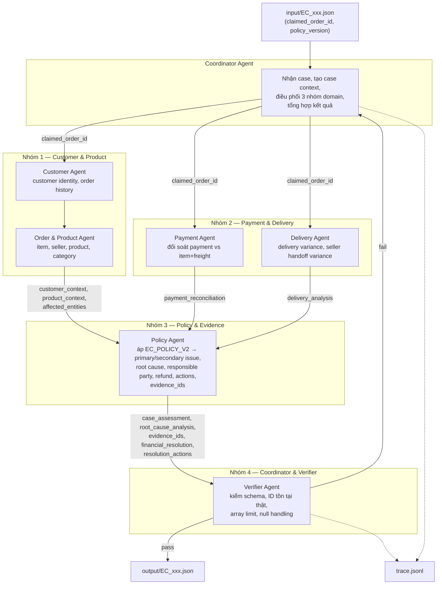

# Kiến trúc Multi-Agent — E-commerce Dispute Resolution

## 1. Tổng quan

Hệ thống gồm 7 agent chuyên biệt, mỗi agent chỉ đọc/ghi trong phạm vi domain của mình và handoff bằng chứng (evidence) cho agent kế tiếp thông qua một **case context** dùng chung. `Coordinator Agent` điều phối toàn bộ vòng đời của một case, `Verifier Agent` là cửa kiểm soát cuối cùng trước khi ghi file `output/`.

Ràng buộc bắt buộc:

- Mỗi agent dùng model ≤ 10B parameters, tên model khai báo rõ trong code và trong `metadata.json`.
- Agent chỉ được nộp evidence ID dựng được từ CSV; không tự suy diễn sự kiện không tồn tại (không có refund ledger, transaction ID, tracking checkpoint theo item).
- `EC_POLICY_V2` áp dụng đúng thứ tự ưu tiên đã định nghĩa trong README mục 4.

## 2. Sơ đồ agent và luồng handoff

## 3. Vai trò, quyền truy cập và bàn giao từng agent

| Agent | Quyền truy cập dữ liệu | Input nhận | Output bàn giao | Đi tới |
| --- | --- | --- | --- | --- |
| **Coordinator** | `input/*.json`, case context (bộ nhớ chung của case) | `input/EC_xxx.json` | `claimed_order_id`, case context khởi tạo; JSON case cuối cùng sau khi Verifier duyệt | Customer, Order&Product, Payment, Delivery Agent → Verifier |
| **Customer Agent** | `customers.csv`, `orders.csv` | `claimed_order_id` | `customer_unique_id`, `related_order_ids` (loại trừ order hiện tại), cờ `repeat_customer` | Order & Product Agent, Policy Agent |
| **Order & Product Agent** | `orders.csv`, `order_items.csv`, `products.csv`, `sellers.csv` | `claimed_order_id` | `affected_entities.{order,item,seller}_ids`, `product_context`, cờ `multi_item_order`/`multi_seller_order`/`multiple_categories` | Policy Agent |
| **Payment Agent** | `order_payments.csv`, `order_items.csv` | `claimed_order_id` | `payment_reconciliation` (`expected_total_brl`, `payment_total_brl`, `difference_brl`, `reconciled`), cờ `split_payment` | Policy Agent |
| **Delivery Agent** | `orders.csv`, `order_items.csv` (shipping_limit_date theo seller) | `claimed_order_id` | `delivery_analysis` (`delivery_variance_hours`, `seller_handoff_analysis`, `late_handoff_seller_ids`) | Policy Agent |
| **Policy Agent** | Không truy cập CSV trực tiếp; chỉ nhận output đã tổng hợp từ 4 agent trên | `customer_context`, `product_context`, `affected_entities`, `payment_reconciliation`, `delivery_analysis` | `case_assessment` (primary/secondary issue, `case_status`, `confidence`), `root_cause_analysis`, `financial_resolution`, `resolution_actions`, `evidence_ids` | Verifier Agent |
| **Verifier Agent** | CSV (để xác minh evidence ID có thật), toàn bộ case context | Case context đầy đủ từ Policy Agent | JSON hợp lệ theo schema mục 6 README, hoặc reject kèm lý do gửi lại Coordinator | `output/EC_xxx.json`, `trace.jsonl` |

## 4. Ánh xạ với phân công nhóm 4 người

| Người phụ trách | Agent sở hữu | Ghi chú |
| --- | --- | --- |
| **Người 1 — Customer & Product Lead** | Customer Agent, Order & Product Agent | Chịu trách nhiệm data loader join CSV dùng chung cho toàn hệ thống |
| **Người 2 — Payment & Delivery Lead** | Payment Agent, Delivery Agent | Công thức tính theo mục 4 README (`handoff_variance_hours`, `difference_brl`,...) |
| **Người 3 — Policy & Evidence Lead** | Policy Agent | Rule engine `EC_POLICY_V2`, sinh evidence ID, không truy cập CSV trực tiếp để tránh side-effect ngoài quy tắc |
| **Người 4 — Coordinator & Verifier / Infra Lead** | Coordinator Agent, Verifier Agent | Orchestration, `trace.jsonl`, `metadata.json`, đóng gói `output/` zip |

## 5. Vòng lặp lỗi (retry/reject)

Nếu Verifier Agent phát hiện vi phạm (evidence ID không tồn tại trong CSV, vượt array limit, sai null handling, sai thứ tự secondary issues/actions), case được trả lại Coordinator kèm lý do cụ thể; Coordinator re-dispatch lại đúng agent liên quan (không chạy lại toàn bộ pipeline) rồi gửi lại Verifier. Toàn bộ vòng lặp này được ghi vào `trace.jsonl`.
